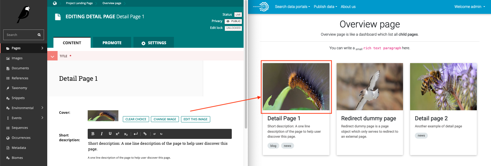

# Using Wagtail: an Editor's guide

The official documentation for editor is already available on [Wagtail Official documentation page](https://docs.wagtail.io/en/v2.7/editor_manual/index.html).

This documentation serves to explain each field in the model and where do they correspond in the rendered HTML page.

## 1. Page type

Link to official documentation [here](https://docs.wagtail.io/en/v2.7/editor_manual/new_pages/selecting_a_page_type.html).

### 1.1 App landing page

### 1.2 Detail index page

Only to be edited by developer(s).

### 1.3 Detail page

### 1.4 Overview page

If the `Overview page` is a child page of another page, the cover image will be appeared in its' parent page if the 
parent page is also an `Overview page` or `App landing page`

## 3. FAQ

### 3.1 Page type

#### 3.1.1 Is it necessary to include a cover image for my page?

It is not required, but it is encouraged to do so. Even though the page itself may not render the image, its parent 
page may renders it (depending on the page type). It helps to give user an idea what the page is about without having 
to visit that page. 

For example: 

`Overview page` ([Overview page type](#14-overview-page)) is the **parent** of `Detail Page 1` 
([Detail page type](#13-detail-page)). 

Figure: Cover image of `Detail Page 1` is shown in its **parent** page `Overview page`.

